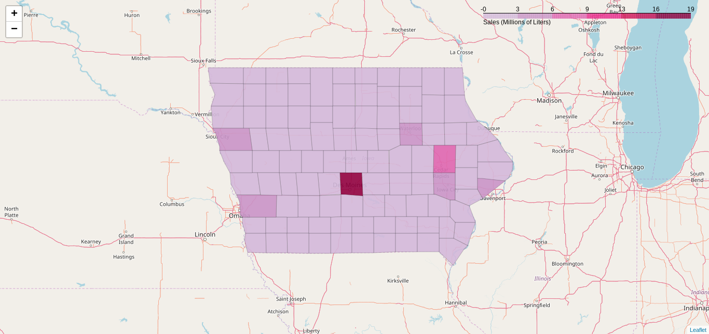
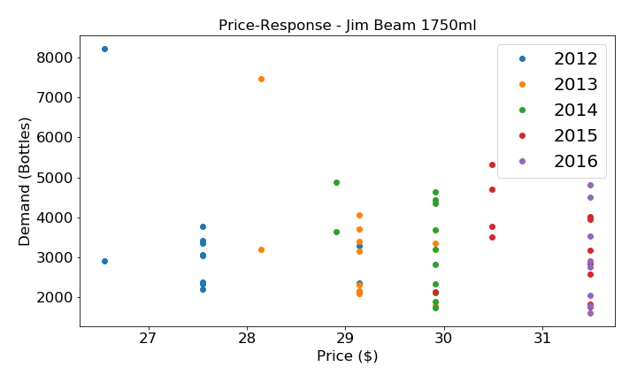
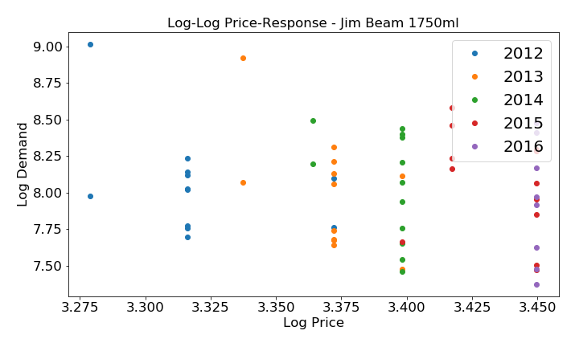
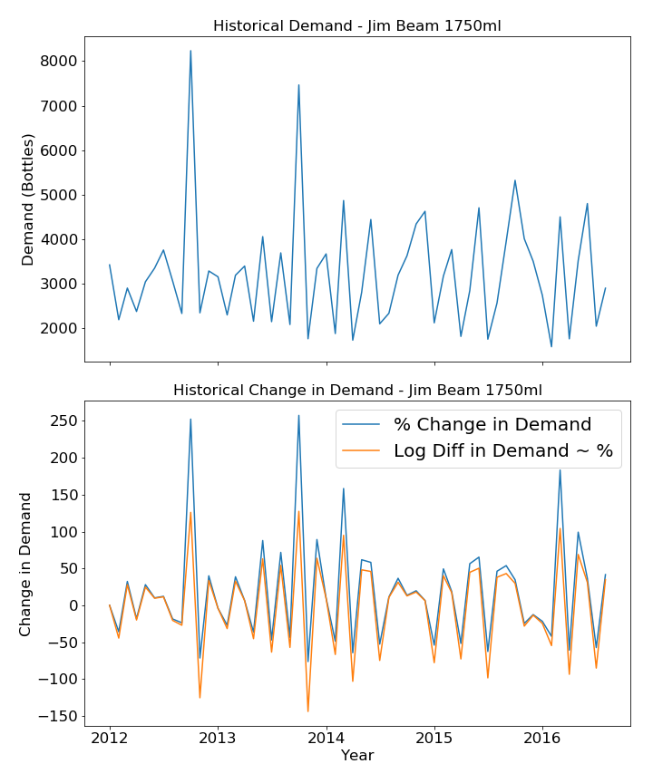
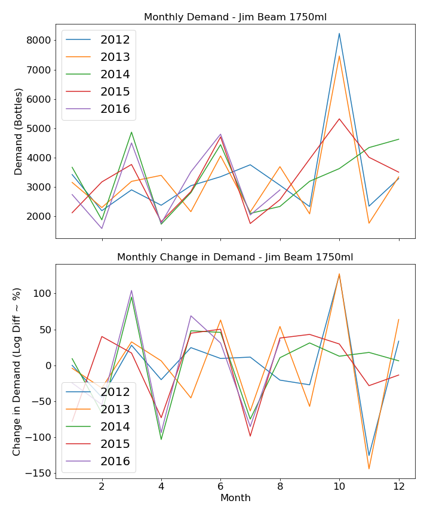
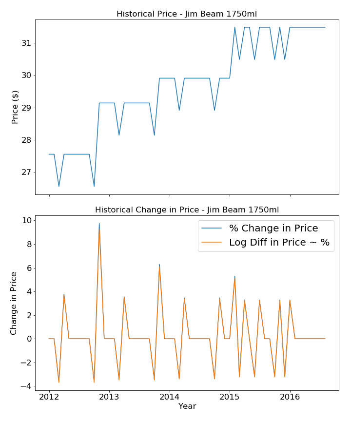
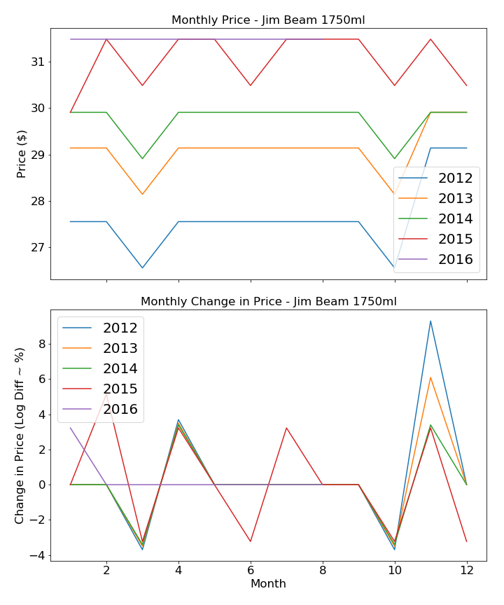

# promotion-optimization
Demand modeling and promotion optimization using Iowa Liquor Sales dataset.

## Research questions

Exploratory data analysis
* Which Iowa counties consume the most liquor by volume?
* Who are the top 10 vendors in Iowa by volume?
* What was the top vendor's top selling liquor by volume?

Statistical hypothesis testing
* Does Iowa City, IA (Hawkeyes) drink more than Ames, IA (Cyclones) per capita? 

Demand modeling
* Predict weekly sales as a function of price, seasonality, etc.

Price optimization
* Optimize price to maximize profit.

## Which Iowa counties consume the most liquor by volume?

## Who are the top 10 vendors in Iowa by sales?
| ID  | Sales (Millions of $) | Vendor                             | 
|-----|-----------------------|------------------------------------| 
| 260 | 307.54                | Diageo Americas                    | 
| 370 | 103.29                | Pernod Ricard USA/Austin Nichols   | 
| 65  | 100.22                | Jim Beam Brands                    | 
| 434 | 96.61                 | Luxco-St Louis                     | 
| 115 | 85.89                 | "Constellation Wine Company, Inc." |
| 85  | 80.92                 | Brown-Forman Corporation           | 
| 421 | 79.48                 | "Sazerac Co., Inc."                | 
| 35  | 67.17                 | "Bacardi U.S.A., Inc."             | 
| 395 | 47.44                 | Proximo                            | 
| 55  | 46.03                 | Sazerac North America              | 

## What are Jim Beam's top selling liquors by sales?
| ItemID | Sales (Millions of $) | VendorID | Item                  | Volume (ml) | 
|--------|-----------------------|----------|-----------------------|-------------| 
| 19068  | 5.39                  | 65       | Jim Beam              | 1750        | 
| 19067  | 4.9                   | 65       | Jim Beam              | 1000        | 
| 34578  | 4.33                  | 65       | Pinnacle Vodka        | 1750        | 
| 15248  | 3.97                  | 65       | Windsor Canadian Pet  | 1750        | 
| 19066  | 3.9                   | 65       | Jim Beam              | 750         | 
| 19476  | 3.88                  | 65       | Maker's Mark          | 750         | 
| 19477  | 3.82                  | 65       | Maker's Mark          | 1000        | 
| 24458  | 3.26                  | 65       | Kessler Blend Whiskey | 1750        | 
| 82847  | 3.09                  | 65       | Dekuyper Peachtree    | 1000        | 
| 10628  | 2.63                  | 65       | Canadian Club Whisky  | 1750        | 

## What is the price-response for Jim Beam 1750ml?

## How has demand for Jim Beam 1750ml varied over time?

## How have prices for Jim Beam 1750ml varied over time?

## Setting APP_TOKEN Environment Variable
In ~/.bashrc add the following at bottom of file:

export APP_TOKEN='YOUR_APP_TOKEN'

App tokens can be obtained [here](https://dev.socrata.com/foundry/data.iowa.gov/spsw-4jax).

## Getting Iowa precinct level shape file

https://sos.iowa.gov/shapefiles/Statewide%20Precinct%20Layer/

https://upload.wikimedia.org/wikipedia/commons/5/5f/USA_Counties_with_FIPS_and_names.svg

